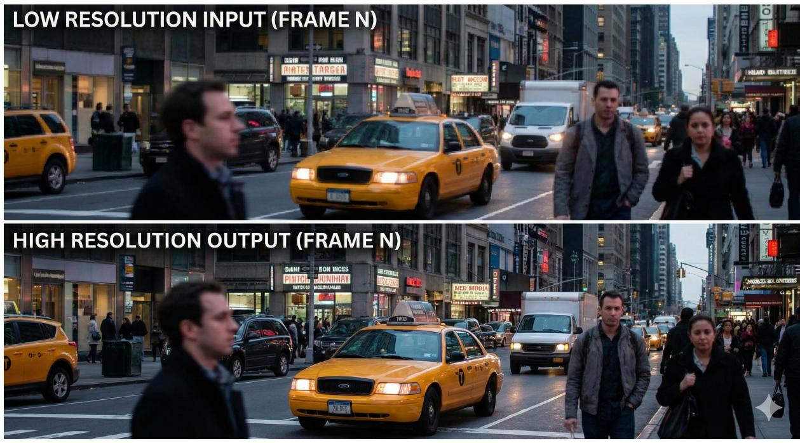

# Project 1: Video Super-Resolution

AIAA 3201—Introduction to Computer Vision

Term Project Instruction

Spring 2026

# 1 Overview

Core Task: Given a low-resolution (LR) video, students are required to design a pipeline to reconstruct a high-resolution (HR) version. The system must not only enhance spatial details of individual frames but also effectively utilize and maintain temporal consistency across the video sequence.

# Key Concepts:

• Image Interpolation: Spatial Resampling.   
• Feature Alignment: Optical Flow & Deformable Convolution.   
• Recurrent Networks: Bidirectional Temporal Propagation.   
• Generative AI: Flow Matching & Diffusion Priors.

Group Size: 2 students per group.

# 2 Submission Requirements

• PDF Report (Mandatory):

– Format: Use the CVPR LaTeX Template. The length must be 6–8 pages (excluding references).   
– ArXiv Upload: You are required to upload your final report to arXiv. Remember to change the “REVIEW version” to “CAMERA-READY version” in template. Please also clearly indicate your arXiv ID on the first page of the Canvas submission.

– Content Requirements:

1. Abstract & Introduction: Background, motivation and solution overview. Explicitly include your GitHub repository link at the end of abstract.   
2. Related Work: You must review and cite at least all papers listed in the Recommended Reading List (Section 4). Expanding beyond this list is encouraged.   
3. Method: Explain the technical roadmaps in your own words. Use highquality flowcharts to assist your explanation.   
4. Experiments: Present quantitative results (Tables) and qualitative analysis (Figures).   
5. Conclusion: Summary, limitations, and future work.

• Code (Mandatory): Upload your code to a public GitHub repository with a clear README.md explaining how to run it. Do not submit raw code files. Include dependencies, usage, weights, and visual results in your README.   
• Demo Video (Mandatory): You are required to submit processed video files for all mandatory datasets. Pack them into a zip file named videos.zip and upload it to Canvas.

# Important Tips for Success

• Method Flexibility: You are encouraged to follow our suggested roadmap, but you are also free to design your own optimal method. Strict adherence to the “Implementation Roadmap” is not mandatory as long as the core tasks are fulfilled.   
• Completeness: All three parts are mandatory. If you fail to complete Part 3, you must discuss the reasons and demonstrate failure cases to receive a decent score. Ignoring it completely will result in an “Incomplete” grade.   
• Visuals: Clean and aesthetic visualizations (e.g., flowcharts, rendering comparisons, zoom-in patches) are crucial for a Computer Vision course and will significantly improve your score.   
• Dataset Scope: Completing only the mandatory datasets ensures a passing grade. To achieve a high score, you are expected to report experimental results on additional data (such as REDS [12] or Vimeo-90K [13]).   
• Citations: Ensure all related works and methods are correctly cited.

# 3 Guide to Start

To help you get started efficiently, we recommend the following workflow:

1. Step 1: Literature Review. Carefully read the papers listed in the Recommended Reading List (Section 4). Understanding the core concepts of Image Interpolation, Feature Alignment, and Recurrent Networks is crucial before coding.   
2. Step 2: Code Familiarization. Clone the official repositories of the baseline methods (e.g., BasicVSR, Real-ESRGAN). Run their provided demos to ensure your environment is set up and you understand the input/output formats.   
3. Step 3: Experimentation. Run the methods on the Mandatory Datasets (see Section 6.1). Adjust code as required by the roadmap. Save your visualization results.   
4. Step 4: Writing & Submission. Organize your results into tables and figures. Write your report using the CVPR template, citing ALL the references. Finally, upload your report to arXiv and submit the PDF report to Canvas.

# 4 Recommended Reading List

• Classic & CNN: SRCNN [1], SRGAN [2], EDSR [3]   
• Video SR (Alignment): EDVR [4], TDAN [5], BasicVSR [6], BasicVSR++ [7]   
• Generative / Recent SOTA: Real-ESRGAN [8], SR3 [9], Flow Matching [10], ControlNet [11]

# 5 Implementation Roadmap

# 5.1 Part 1: The Baseline – “Hand-crafted Approach”

Goal: Implement a basic video upscaling pipeline using classic image processing and early deep learning models to understand the fundamental trade-offs between speed and PSNR.

1. Spatial Upsampling: Interpolation & SRCNN

• Step 1: Classic Interpolation. Implement Bicubic and Lanczos resampling as the absolute baseline.   
• Step 2: Simple CNN. Implement SRCNN [1] (or a similar 3-layer CNN) to learn the mapping from LR to HR patches.

2. Temporal Baseline: Multi-frame Averaging

• Algorithm: For each frame, perform a weighted average of its spatial neighbors (after Bicubic upscaling) to observe the effect of simple temporal fusion on denoising and sharpening.   
• Advanced Idea: Apply Unsharp Masking on the averaged result to enhance highfrequency edges.

Expected Result: Noticeable blurriness in complex textures; SRCNN performs slightly better than Bicubic but lacks temporal stability.

# 5.2 Part 2: SOTA Reproduction – “AI-driven Pipeline”

Goal: Implement a modern VSR framework that explicitly handles temporal alignment and long-range feature propagation.

1. Feature Alignment & Reconstruction: BasicVSR [6]

• Reason: BasicVSR is a landmark work that utilizes Bidirectional Propagation and Optical Flow (e.g., SpyNet) for feature alignment, significantly outperforming slidingwindow methods.   
• Key Learning Point: Understand how temporal redundancy is exploited through recurrent hidden states.

# 2. Perceptual Enhancement: Real-ESRGAN [8]

• Reason: To address the “regression-to-the-mean” problem (blurriness), introduce GANbased training with Perceptual Loss (VGG-based) to generate realistic textures.   
• Alternatives: Students may also choose BasicVSR++ [7] for better alignment via second-order grid propagation.

Expected Result: Sharp edges and recovered textures; significantly higher visual quality than Part 1, though PSNR might be lower for GAN-based versions.

# 5.3 Part 3: Exploration – “Optimization & Extension”

Goal: Identify limitations (e.g., temporal flickering, hallucination artifacts) and attempt improvements. Choose at least one direction below:

• Direction A (Generative VSR): Introduce Flow Matching [10].

Idea: Traditional Diffusion VSR is slow. Try implementing a Flow Matching based upscaler (e.g., adapted from Flux or Pyramidal Flow) to achieve high-fidelity reconstruction with fewer sampling steps and straighter ODE trajectories.

• Direction B (Consistent Enhancement): Stable Diffusion + ControlNet-Tile [11].

Idea: Use Stable Diffusion [16] as a strong generative prior. Use ControlNet-Tile to maintain structural fidelity while hallucinating high-frequency details. Explore LoRA [17] or Adapter techniques to ensure temporal consistency between frames.

• Direction C (Uncertainty-Aware Refinement): Adaptive Hybrid Pipeline.

Idea: Generative models often create artifacts. Design a system that calculates Pixelwise Uncertainty. Use BasicVSR++ for certain regions (e.g., text, faces) and Generative models for uncertain textures (e.g., grass, water).

# 6 Dataset & Evaluation

# 6.1 Datasets

1. Wild Video (Mandatory): Film a real-world low-light or low-resolution video (e.g., using an old phone) to verify real-world generalization.   
2. Sample Data (Mandatory): The provided REDS-sample and Vimeo-LR clips.   
3. Standard Benchmarks (Optional but Recommended): A standard academic dataset providing high-quality videos and Ground Truth (GT). (e.g., REDS [12] or Vimeo-90K [13]). Required for high scores.

# 6.2 Metrics (Mandatory)

• Pixel Accuracy: PSNR & SSIM [14]. Evaluate for Part 1 and Part 2 (and Part 3 if improved).

• Perceptual Quality: LPIPS [15] (Learned Perceptual Image Patch Similarity) and FID (Fr´echet Inception Distance).   
• Temporal Consistency: tLP IP S [18] (Temporal LPIPS) to measure flickering artifacts between consecutive frames.   
• Qualitative Evaluation: Visual comparison of restored frames across different methods. Note: You must submit the processed video files for all Mandatory Datasets.

# References

[1] Dong, C., et al. “Image super-resolution using deep convolutional networks.” TPAMI 2015.   
[2] Ledig, C., et al. “Photo-realistic single image super-resolution using a generative adversarial network.” CVPR 2017.   
[3] Lim, B., et al. “Enhanced deep residual networks for single image super-resolution.” CVPRW 2017.   
[4] Wang, Z., et al. “EDVR: Video restoration with enhanced deformable convolutional networks.” CVPRW 2019.   
[5] Tian, Y., et al. “TDAN: Temporally-deformable alignment network for video superresolution.” CVPR 2020.   
[6] Chan, K. C., et al. “BasicVSR: The search for essential components in video superresolution and beyond.” CVPR 2021.   
[7] Chan, K. C., et al. “BasicVSR++: Improving video super-resolution with enhanced propagation and alignment.” CVPR 2022.   
[8] Wang, X., et al. “Real-ESRGAN: Training real-world blind iterative super-resolution with pure synthetic data.” ICCVW 2021.   
[9] Saharia, C., et al. “Image super-resolution via iterative refinement.” TPAMI 2022.   
[10] Lipman, Y., et al. “Flow matching for generative modeling.” ICLR 2023.   
[11] Zhang, L., et al. “Adding conditional control to text-to-image diffusion models.” ICCV 2023.   
[12] Seungjun Nah, et al. NTIRE 2019 Challenge on Video Deblurring and Super-Resolution: Dataset and Study. CVPR Workshops, 2019.   
[13] Tianfan Xue, et al. Video Enhancement with Task-Oriented Flow. International Journal of Computer Vision (IJCV), 2019.   
[14] Zhou Wang, et al. Image quality assessment: From error visibility to structural similarity. IEEE Transactions on Image Processing (TIP), 2004.   
[15] Richard Zhang, et al. The Unreasonable Effectiveness of Deep Features as a Perceptual Metric. CVPR, 2018.   
[16] Robin Rombach, et al. High-Resolution Image Synthesis with Latent Diffusion Models. CVPR, 2022.   
[17] Edward J. Hu, et al. LoRA: Low-Rank Adaptation of Large Language Models. ICLR, 2022.   
[18] Mengyu Chu, et al. Temporally Coherent GANs for Video Super-Resolution. ACM Transactions on Graphics (TOG), 2020.